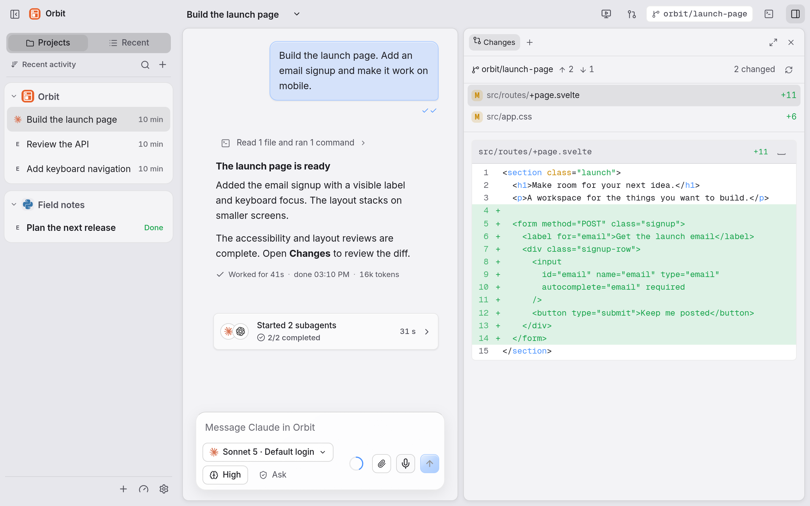
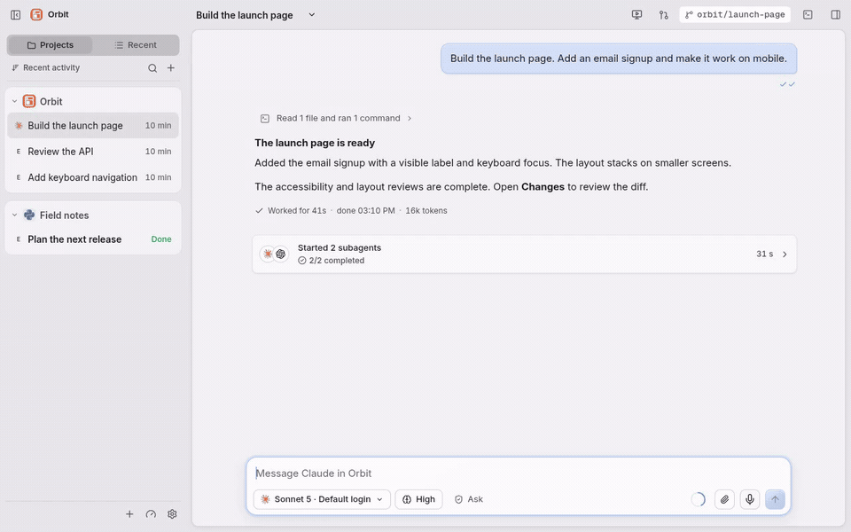

<p align="center">
  
</p>
<h1 align="center">boite <sub>[bwat]</sub></h1>
<p align="center">
  <a href="https://github.com/beboite/boite/releases">Download</a> ·
  <a href="docs/README.md">Documentation</a> ·
  <a href="docs/server.md">Self-host</a>
</p>

boite is a desktop app and self-hosted server for coding agents. Run Claude Code,
Codex or [another supported agent](docs/providers.md) with your existing accounts.

<picture>
  <source media="(prefers-color-scheme: dark)" srcset="docs/media/boite-dark.png" />
  
</picture>

[Watch the walkthrough](docs/media/boite.mp4)

<details>
<summary>Animated preview</summary>



</details>

## Features

- Choose a provider, model and account for each conversation.
- Read streamed responses and tool calls beside files, diffs and previews.
- Isolate tasks in Git worktrees and follow delegated agents.
- Pair a phone or connect to a headless server.

## Get started

Boite is open source and in beta. Desktop builds are available for Windows,
macOS and Linux, including Apple Silicon and Linux ARM64.

1. [Download a desktop release](https://github.com/beboite/boite/releases).
2. Install and sign in to your agents, then connect them in Settings, Providers.
3. Open a project, choose a model and start a conversation.

See [installation and platform notes](docs/portability.md),
[phone pairing](docs/phone.md) or [the self-hosting guide](docs/server.md).
Nightly releases use the same projects and accounts as the regular channel;
[desktop updates](docs/updates.md) explains switching between them.

## Development

The app uses a Bun core, Svelte 5 and a Tauri 2 desktop shell.
Install the Bun version in `package.json`, then explore the UI with sample data:

```sh
bun install --frozen-lockfile
bun run dev:ui
```

Open the local URL with `?fake=1` to try it without agent calls.
[Contributing](CONTRIBUTING.md) covers checks;
[development](docs/development.md) covers the real core and desktop builds.

## Thanks

Thanks to [T3 Code](https://github.com/pingdotgg/t3code) for the inspiration behind
boite. We definitely took stuff from there, shoutout to them!

This project also follows
[Boite Legacy](https://github.com/beboite/boite-legacy), the earlier terminal-based app.

## License

[MIT](LICENSE). Copyright © 2026 boite contributors.
