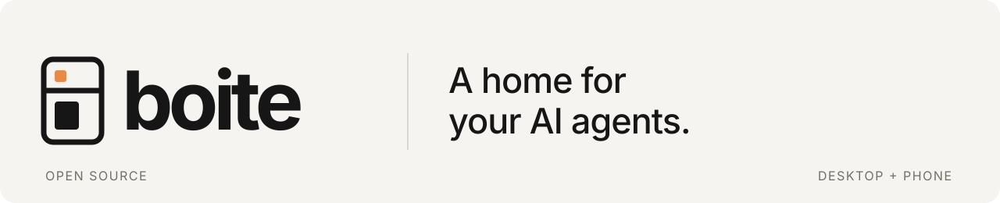

<p align="center">
  <picture>
    <source media="(prefers-color-scheme: dark)" srcset="docs/media/header-dark.svg" />
    
  </picture>
</p>

<p align="center">
  Run your coding agents in one workspace, with the conversation and changes side by side.
</p>
<p align="center">
  <a href="https://github.com/beboite/boite/releases">Download Boite</a> &nbsp; / &nbsp;
  <a href="docs/README.md">Read the docs</a> &nbsp; / &nbsp;
  <a href="docs/server.md">Self-host</a>
</p>

<p align="center">
  <picture>
    <source media="(prefers-color-scheme: dark)" srcset="docs/media/boite-dark.png" />
    
  </picture>
</p>
<p align="center">
  <a href="docs/media/boite.mp4">Watch the 10-second walkthrough</a><br />
  <sub>Real interface, sample project. Light and dark themes.</sub>
</p>

<details>
<summary>Play the walkthrough here</summary>


</details>

## Your project, in one place

<table>
<tr>
<td width="50%" valign="top">
<h3>Choose your agent</h3>
<p>Pick the provider and model for each conversation. Use Claude Code, Codex or <a href="docs/providers.md">another supported agent</a> with your existing accounts.</p>
</td>
<td width="50%" valign="top">
<h3>Chat beside the diff</h3>
<p>Read streamed answers and tool calls. Inspect files, code changes and previews beside the conversation.</p>
</td>
</tr>
<tr>
<td width="50%" valign="top">
<h3>A branch for each task</h3>
<p>Start an isolated Git worktree for a conversation. Follow delegated agents and open their results from the chat.</p>
</td>
<td width="50%" valign="top">
<h3>Desktop and phone</h3>
<p>Pair a phone to read and steer work on your computer, or connect to a self-hosted headless server.</p>
</td>
</tr>
</table>

## Get started

Boite is open source and in beta. Desktop builds are available for Windows,
macOS and Linux, including Apple Silicon and Linux ARM64.

1. [Download a desktop release](https://github.com/beboite/boite/releases).
2. Install and sign in to your agents, then connect them in Settings, Providers.
3. Open a project, choose a model and start a conversation.

See [installation and platform notes](docs/portability.md),
[phone pairing](docs/phone.md) or [the self-hosting guide](docs/server.md).
Nightly releases use the same projects and accounts as the regular channel;
[desktop updates](docs/updates.md) explains switching between them.

## Develop Boite

The app uses a Bun core, Svelte 5 and a Tauri 2 desktop shell.
Install the Bun version in `package.json`, then explore the UI with sample data:

```sh
bun install --frozen-lockfile
bun run dev:ui
```

Open the local URL with `?fake=1` to try it without agent calls.
[Contributing](CONTRIBUTING.md) covers checks;
[development](docs/development.md) covers the real core and desktop builds.

---

Inspired by [T3 Code](https://github.com/pingdotgg/t3code), with code that helped
shape Boite. This project follows [Boite Legacy](https://github.com/beboite/boite-legacy).
Licensed under [MIT](LICENSE).
