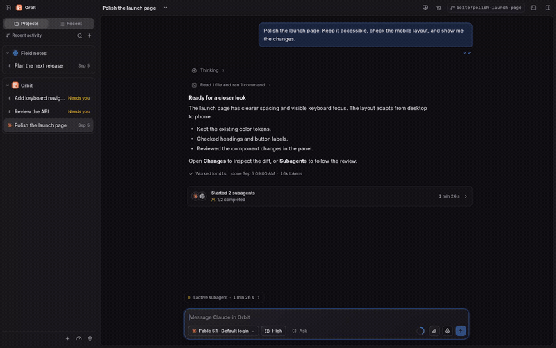

<p align="center">
  
</p>
<h1 align="center">boite <sub>[bwat]</sub></h1>
<p align="center">Your AI agents, in one workspace.</p>
<p align="center">
  <a href="https://github.com/beboite/boite/releases">Download</a> ·
  <a href="docs/server.md">Self-host</a> ·
  <a href="docs/README.md">Documentation</a> ·
  <a href="CONTRIBUTING.md">Contribute</a>
</p>

Run Claude Code, Codex, Muse Code, OpenCode, Antigravity, Grok and pi in a
shared chat interface, with their own protocols and your existing accounts.
Give each task a conversation, keep its files and changes beside the chat,
and follow the work from your desktop or a paired phone.

<p align="center">
  <picture>
    <source media="(prefers-reduced-motion: reduce) and (prefers-color-scheme: light)" srcset="docs/media/boite-light.png" />
    <source media="(prefers-reduced-motion: reduce)" srcset="docs/media/boite-dark.png" />
    <source media="(prefers-color-scheme: dark)" srcset="docs/media/boite-dark.gif" />
    <source media="(prefers-color-scheme: light)" srcset="docs/media/boite-light.gif" />
    
  </picture>
</p>
<p align="center">
  Watch the full walkthrough:
  <a href="docs/media/boite-dark.mp4">Dark mode</a> ·
  <a href="docs/media/boite-light.mp4">Light mode</a>
</p>

The walkthroughs use staged sample data in the real Boite web interface.
They show the same task in both themes, from choosing a model to reviewing
changes and following subagents. The phone scene illustrates the paired-device
layout; agents execute on the computer that holds the project.

## From a task to its result

- Keep projects and conversations together. Give a task its own Git worktree
  when it needs an isolated branch.
- Pick a provider, model and account for the task. Switch inside a conversation
  with context carried from its journal.
- Follow streamed answers, reasoning, tool calls and requests for your input.
  Queue more work with global and per-account concurrency limits.
- Inspect files, diffs, tasks and agent results in the panel beside the chat.
  Open HTML and media delivered by an agent without losing the conversation.
- Let agents delegate work and exchange messages. Follow their tasks and
  results from the conversation's Subagents panel.
- Pair a phone or connect to another machine. Read and steer work where it
  runs, including a self-hosted headless server.

Boite is open source and in beta. The desktop app and web client share a Bun
core, which runs the agents and stores the conversation journal.

## Get started

1. [Download a release](https://github.com/beboite/boite/releases) for your system.
2. Install and sign in to the agents you want to use on the computer running
   your projects. Connect them in Settings, Providers.
3. Open a project folder, choose a model and start a conversation.

| System | Download |
| --- | --- |
| Windows x64 | `Boite_<version>_x64-setup.exe` |
| macOS 13+, Apple Silicon | `Boite_<version>_aarch64.dmg` |
| macOS 13+, Intel | `Boite_<version>_x64.dmg` |
| Linux x64 | `Boite_<version>_amd64.deb` or `Boite_<version>_amd64.AppImage` |
| Linux ARM64 | `Boite_<version>_arm64.deb` or `Boite_<version>_aarch64.AppImage` |

Choose a regular release for Boite or a nightly prerelease for boite (de nuit).
Both update channels keep the same projects, accounts and conversations.
Switch channels in General settings; signed updates download in the background
and ask before restarting. See [desktop updates](docs/updates.md).

<details>
<summary>macOS and Linux installation notes</summary>

A macOS build signed with the project's Apple Developer ID is notarized.
For an ad hoc build, drag Boite to Applications, then run
`xattr -cr /Applications/Boite.app` once, or allow it in System Settings,
Privacy & Security.

Linux packages require glibc 2.35 or newer and WebKitGTK 4.1. AppImages also
need FUSE 2 (`libfuse2`) and must be made executable.

Windows supports process tracing, resource caps, audio muting and focus guards.
Linux and macOS have more limited process tracking and do not provide those
caps or guards. See [platform readiness](docs/portability.md).

</details>

## Run it your way

| You want to | Start here |
| --- | --- |
| Connect providers and manage accounts | [Providers](docs/providers.md) and [accounts](docs/accounts.md) |
| Use Boite from a phone | [Pairing and phone access](docs/phone.md) |
| Run agents on another computer | [Machines](docs/machines.md) |
| Run a headless server or Docker container | [Self-hosting](docs/server.md) |
| Coordinate agents and repeat a workflow | [Coordination](docs/coordination.md) and [workflows](docs/workflows.md) |
| Understand what the app stores and runs | [Architecture](docs/architecture.md) |

## Build from source

Boite uses Bun, TypeScript, Svelte 5 and Tauri 2. Install the Bun version named
in `package.json`, then:

```sh
bun install --frozen-lockfile
bun run build:ui
bun run dev:core
```

In another terminal, create a one-time owner pairing link and open it in your
browser:

```sh
bun packages/core/src/main.ts pair --owner
```

For UI development, run `bun run dev:ui`. Add `?fake=1` to the local URL to
explore the interface with sample data and no agent calls.

[Contributing](CONTRIBUTING.md) covers checks and setup.
[Development](docs/development.md) covers tests and captures, including how to
re-record the walkthroughs. [Building and releasing](docs/releasing.md) covers
desktop installers.

## Thanks

Thanks to [T3 Code](https://github.com/pingdotgg/t3code) for the inspiration and
code that helped shape Boite. This project follows
[Boite Legacy](https://github.com/beboite/boite-legacy), the earlier terminal app.

## License

[MIT](LICENSE). Copyright © 2026 boite contributors.
